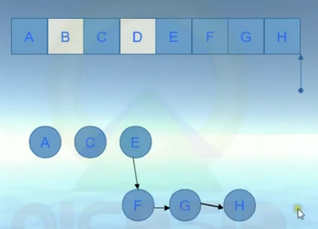
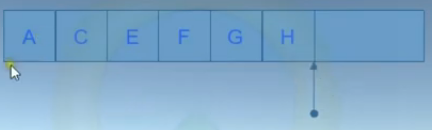

# CICLO DE VIDA DEL OBJETO

CONCEPTOS BASICOS
NEW:
> SE CREA LA INSTANCIA DEL OBJETO EN EL HEAP
REGRESA UNA REFERENCIA DE ESE OBJETO, NO EL OBJETO EN SI

VARIABLE
> SE CREA EN EL STACK SI ES UNA VARIABLE LOCAL.
GUARDA LA REFERENCIA

EL CLR SE ENCARGA DEL OBJETO UNA VEZ QUE HA SIDO CREADO. EL RECOLECTOR DE BASURA LO DESTRUIRA CUANDO YA NO SEA NECESARIO  
> REMUEVE EL OBJETO CUANDO YA NO PUEDE SER ALCANZADO POR ALGUNA PARCE DEL CODIGO
> EJEMLPO: CUANDO SE CREA LOCALMENTE EN UN METODO Y EL METODO FINALIZA LA EJECUCION.
> NO HAY GARANTIA QUE SERA DESTRUIDO EXACTAMENTE EN ESE MOMENTO.

# CREACION DE LA INSTANCIAS.
SE CALCULA LA CANTIDAD DE MEMORIA REQUERIDA PARA EL OBJETO.
* SE VERIFICA QUE ES HEAP ADIMINISTRADO TENGO SUFICIENTE ESPACIO.
* SI LO HAY, EL CONSTRUCTOR ES INVOCADO Y QUIEN LO HIZO RECIBE UNA REFERENCIA AL NUEVO OBJETO EN MEMORIA.
* LA DIRECCION ES LA DEL APUNTADOR AL SIGUIENTE OBJETO.
* LA DIRECCION DEL APUNTADOR AL SIGUIENTE OBJETO ES ACTUALIZADA AL SIGUIENTE ESPACIO DESIPONIBLE.
> CLASE1 OBJETO1 = NEW CLASE1(); ==> HEAD ADMINISTRADO 
> CLASE2 OBJETO2 = NEW CLASE2(); ==> | OBJETO1 | OBJETO2 |      |  

## APPLICATION ROOTS
LOCACION DONDE SE GUARDA UNA REFERENCIA HACIA UN OBJETO EN EL HEAP ADMINISTRADO.
 - REFERENCIAS A OBJETOS GLOBALES NO C# , SI EL CIL.
 - REFERENCIAS A OBJETO ESTATICOS.
 - REFERENCIAS A OBJETOS LOCALES.
 - REFERENCIAS A OBJETOS PASADOS COMO PARAMETROS EN UN METODO.
 - REFERENCIAS A OBJETOS ESPERADO SER FINALIZADOS.
 - CUALQUIER REGISTRO DEL CPU QUE REFENRIA A UN OBJETO.

# RECOLECCION DE BASURA.
* SE INVESTIGA EL HEAP ADMINISTRADO PARA VER QUE OBJETOS ESTAN ROOTED.
 - PARA ESTO EL CLR CREA UN OBJECT GRAPH.
 - NINGUN OBJETO PUEDE APARECER DOS O MAS VECES EN LA GRAFICA.
* LOS OBJETOS QUE NO SE PUEDEN ALCANZAR SON MARCADOS COMO BASURA.
* SE ELIMINAN DE MEMORIA Y EL HEAP ES COMPACTADO.
* EL APUNTADOR A SIGUIENTE OBJETO ES ACTUALIZADO.

* GENERACIONES DE OBJETOS.
PODEMOS TENER TRES POSIBLES GENERACIONES. PARA QUE NOS SIRVE, NOS SIRVE PARA LLEVAR A CABO OPTIMIZACION EN EL RECOLECTOR DE BASURA.

GENERACION 0
> OBJETOS RECIEN CREADOS QUE NUNCA HAS SIDO MARCADOS PARA RECOLECCION.

GENERACION 1
> OBJETOS QUE HAN SOBREVIVIDO A UNA RECOLECCION.

GENERACION 2
> OBJETOS QUE HAN SOBREVIVIDO MAS DE UNA RECOLECCION.

LAS GENERACIONES 0 Y 1 SE CONOCEN COMO EFIMERAS.

## RECOLECCION DE BASURA .NET 1.0 A 3.5
RECOLECCION DE BASURA CONCURRENTE. CUANDO SE HACE RECOLECCION DE BASURA PARA GENERACIONES EFIMERAS, EL RECOLECTOR DE BASURA SUSPENDE LOS HILOS ACTIVOS. ESTO CON EL FIN DE EVITAR QUE LOS PROCESOS ACCESEN AL HEAP DURANTE LA RECOLEECCION.

## RECOLECCION DE BASURA .NET 4.0 EN ADELANTE
HAY UN CAMBIO EN EL RECOLECTOR DE BASURA QUE LO HACE MAS EFICIENTE. SE CONOCE COMO BACKGROUND GARAGE COLLECTION. LO HACE PORQUE PUEDE TENER UN HILO DEDICADO,SI EL RECOLECTOR TRABAJA EN UNA GENERACION NO EFIMERA, PUEDE USAR UN HILO DEDICADO PARA LAS GENERACIONES EFIMERAS. REDUCE LA CANTIDAD DE TIEMPO NECESARIA.