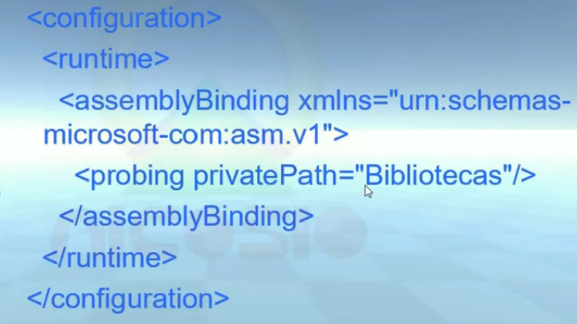
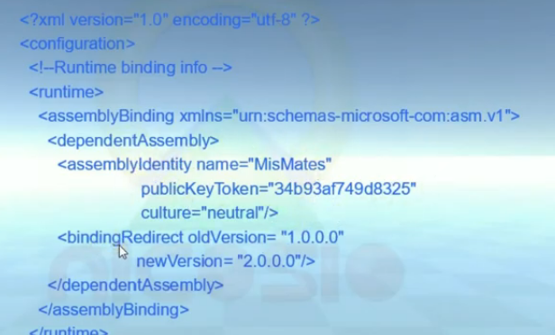

# ASSEMBLIES PRIVADOS
UNA COLECCION DE TIPOS Y RECURSOS COMPILADOS PARA FUNCIONAR EN CONJUNTO Y FORMAR UNA UNIDAD LOGICA DE FUNCIONALIDA.
LOS ASSEMBLIES PRIVADOS VAN EN EL MISMO DIRECTORIO QUE LA APLICACION QUE LOS USA. EL RUNTIME NO CONSULTA EL REGISTRO, LOS BUSCA LOCALMENTE.
COMO NO SE USA EL REGISTRO, INSTALAR Y DESINSTALAR UNA APLICACION ES MUY SENCILLO.

* IDENTIDAD
SU IDENTIDAD CONSISTE EN SU NOMBRE Y VERSION  NUMERICA. SE GUARDAN EN EL MANIFIESTO, NO TIENEN UN CHEQUEO DE VERSION COMPLEJO POR SU PROPIA NATURALEZA.

* PROBING
ES EL PROCESO DE MAPEAR UN ASSEMBLY AL ARCHIVO BINARIO QUE LE CORRESPONDE.
LA CARGA DEL ASSEMBLY PUEDE SER IMPLICITA O EXPLICITA. LA CARGA IMPLICITA ES CUANDO EL CLR CONSULTA EL MANIFIESTO PARA ENCONTRAR LA LOCACION DEL ASSEMBLY. LA CARGA EXPLICITA ES CUANDO SE USA load() O LoadFrom() DE LA CLASE ASSEMBLY

* CONFIGURACION
POR ORDEN ES BUENO COLOCAR LOSASSEMBLIES EN CARPETAS U NO SOLO AL MISMO NIVEL QUE EL .EXE. EL CLR NO VA A BUSCAR EN LAS CARPETAS A MENOS QUE SE COLOQUE UN ARCHIVO DE CONFIGURACION.

LOS ARCHIVOS DE CONFIGURACION TIENEN EL MISOM NOMBRE QUE LA APLICACION CON LA EXTENSION .CONFIG, SE PUEDEN CREAR DESDE VISUAL STUDIO O AFUERA.

# ASSEMBLIES COMPARTIDOS
* SHARED ASSEMBLY
UNA SOLA VERSION DEL ASSEMBLY PUEDE SER USADA POR MULTIPES APLICACIONES EN LA MISMA MAQUINA Y ES RESULTAR INCOMODO. NO SE COLOCAN EN EL MISMO DIRECTORIO QUE LA APLICACION QUE LOS USA.
SE INSTALAN EN EL GLOBAL ASSEMBLY CACHE,
* STRONG NAME.
SE USA PARA IDENTIFICAR DE FORMA UNICA AL PUBLICANTE DEL ASSEMBLY. SE BASAN TAMBIEN EN DOS LLAVSE CRIPTOGRAFICAS RELACIONASDAS ENTRE SI.
 -NOMBRE DEL ASSEMBLY
 -LA VERSION DEL ASSEMBLY
 -LA LLAVE PUBLICA
 -UN VALOR DE IDENTIDAD DE CULTURA
 -UNA FIRMA DIGITAL

 LO PRIMERO ES GENERAR LA LLAVE PUBLICA Y PRIVADO CON SN.EXE.
 CUANDO EL COMPILADOR RECONOCE EL ARCHIVO NSK, REGISTRA LA LLAVE PUBLICA EN EL MANIFIESTO.
 EL COMPILADOR GENERA UN HASH CODE BASADO EN LOS CONTENIDOS DEL ASSEMBLY
 EL HASH CODE ES COMBINADO CON LA LLAVE PRIVADO PARA CREAR LA FIRMA DIGITAL QUE SE COLOCA EN EL ASSEMBLY
 SI ALGO CAMBIA, AUNQUE SEA UN SOLO CARACTER, SE VUELVE A GENERAL EL HASH CODE.

 ## INSTALACION DE UN ASSEMBLY FUERTEMENTE NOMBRADO.
 LO MAS RECOMENDADO ES CREAR UN PAQUETE DE INSTALACION MSI
 TAMBIEN PUEDE USAR UNA VERSION COMERCIAL COMO INSTALLSHIELD
 SI  SE DESEA POR LINEA DE COMANDO SE PUEDE HACER USO DE GACUTIL.EXE

 ## USO DE UN SAHRED ASSEMBLY
 DESDE LA PERSPECTIVA DE VISUAL STUDIO ES LO MISMO. SIMPLMEMENTE LO ADICIONAMOS CON LA HERRAMIENTA PARA ADICIONAR REFERENCIAS.

# CONFIGURACION DE SHARED ASSEMBLY.
SE CONFIGURA TAMBIEN CON EL ARCHIVO *.CONFIG, COMO SE COLOCAN EN EL GAC NO ES NECESARIO <PRIVATEPATH>
SE UTILIZA CUANDO DESEAMON UTILIZAR UNA VERSION DIFERENTE DE UN ASSEMBLY Y PARA POR ALTO LA QUE APARECE EN EL MANIFIESTO
EN ACTUALIZACIONES

* PUBLISHER POLICY ASSEMBLIES.
ES UNA VERSION BINARIA DE *.CONFIG QUE SE INSTALA EN EL GAC. DE ESTA FORMAS TODOS LOS PROGRAMAS QUE USEN UN ASSEMBLY EN PARTICULAR SE PUEDEN ACTUALIZAR A LA NUEVA VERSION. SE CREAN CON LA UTILERIA AL.EXE
NECESINA VARIOS DATOS.
- LOCACION DEL *.CONFIG CON LAS INSTRUCCIONES DE REDIRECCIONAMIENTO.
- NOMBRE DEL PUBLISHER POLICY ASSEMBLY.
- LOCACION DEL *.SNK PARA LA FIRMA DIGITAL.
- LA VERSION DE PPA A CONSTRUIR.

* <CODEBASE>
SE USA PARA DECIRLE AL CLR QUE BUSQUE POR ASSEMBLIES EN LOCACIONES ARBITRARIAS COMO EN OTRA MAQUINA LOCALIZADA EN LA RED.
SI ESTA EN UNA MAQUINA REMOTA, SE DESCARGARA EL ASSEMBLY A UN DIRECTORIO ADENTRO DEL GAC. TAMBIEN PUEDE USARSE PARA ASSEMBLIES EN LA MISMA MAQUINA COMO UNA ALTERNATIVA A <PRIVATEPATH>
